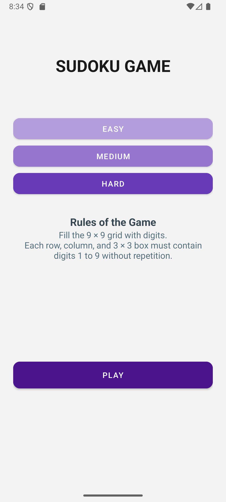
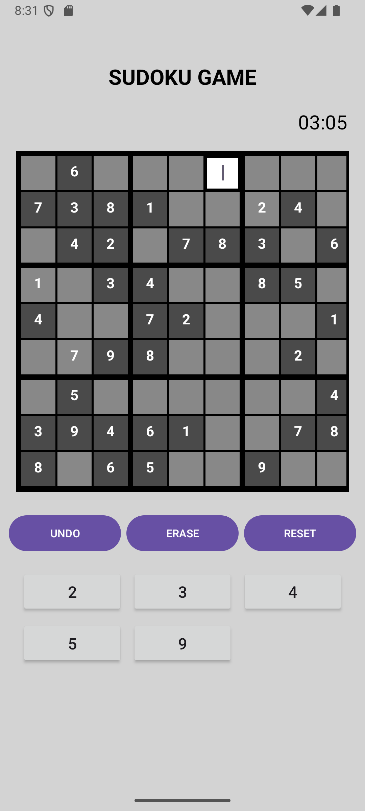

# Sudoku Game App

**Sudoku Game App** is a fully functional Android-based Sudoku puzzle game developed in Java using the MVVM architecture. It offers multiple difficulty levels, a countdown timer, real-time validation, and intuitive input via both keyboard and number pad.

## Features

- Sudoku puzzle generator with three difficulty levels: Easy, Medium, and Hard  
- Interactive 9x9 Sudoku board with editable and fixed cells  
- Countdown timer with an alert when time runs out  
- Ability to erase values from selected cells  
- Undo functionality to revert the last move  
- Option to reset the game at any point  
- Win dialog displayed upon successful completion  
- Input validation with error messages for invalid entries  
- Dynamic number pad showing only valid inputs for the selected cell  

## Screenshots

*Main screen with difficulty selection:*  


*Gameplay screen with Sudoku grid and number pad:*  



## Tech Stack

- Language: Java  
- Architecture: MVVM (Model-View-ViewModel)  
- UI: XML Layouts, GridLayout, and custom drawables  
- Reactive Components: LiveData and ViewModel  
- Framework: Android SDK  

## Clone

```bash
git clone https://github.com/your-username/SudokuApp.git
